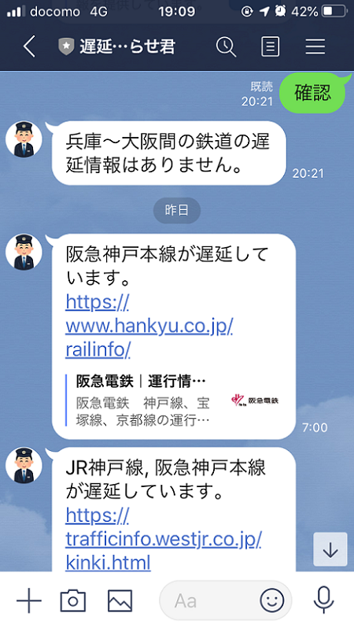

# 電車遅延お知らせ BOT

---

## 概要

兵庫～大阪間の電車の遅延情報をお知らせする LINE Bot です。

**※このサービスは動作しません。**

- 平日の通勤の時間帯（7 ～ 10 時と 17 ～ 19 時の間）に遅延が発生していれば通知します。
- 送信されたメッセージ内容に応じて遅延情報の返答もできます。
- [鉄道遅延情報の json](https://rti-giken.jp/fhc/api/train_tetsudo/) さんにアクセスし、取得結果をもとにメッセージを作成しています。

### 利用画面

### QR コード

以下のQRコードを読み取ると、このLINE Botを利用できます。

### 対応路線一覧

| 運営会社名   | 路線名     |
| :----------- | :--------- |
| JR 西日本    | 学研都市線 |
| JR 西日本    | JR 東西線  |
| JR 西日本    | JR 神戸線  |
| 阪急電鉄     | 阪急線     |
| 阪急電鉄     | 神戸線     |
| 阪急電鉄     | 神戸本線   |
| 阪神電気鉄道 | 阪神線     |
| 阪神電気鉄道 | 阪神本線   |
| 阪神電気鉄道 | 神戸高速線 |

## 開発者向け情報

[こちら](./docs/for_developers.md)です。

## コントリビュート

小さなtypoでもIssueやPull Requestを歓迎しています。

コントリビュートの方法については[こちら](./CONTRIBUTING.md)を参照してください。
